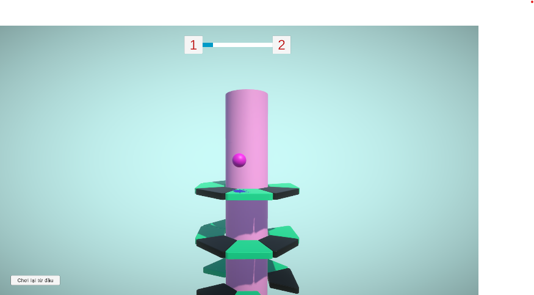

# Helix Jump Clone 🌀

Hi there! I'm a freshly graduated IT Engineer, and this is my personal project cloning the core loop of the famous "Helix Jump" game. 

I built this project mainly to get my hands dirty with Unity's physics and to practice writing clean, cross-platform input logic. 

🎮 **You can play it right in your browser here:** [Play on itch.io](https://arapat1412.itch.io/helixjumpmogia)

## 💡 What I Learned from this Project

As a Fresher, building this from scratch taught me a lot of practical Unity skills:

* **Handling Inputs Smoothly:** I wrote a single `HelixRotator.cs` script that seamlessly handles both Mouse dragging (for PC/WebGL) and Touch swiping (for Android) using preprocessor directives. 
* **Procedural Generation:** Instead of placing level obstacles manually, I created a `HelixManager` that dynamically spawns rings based on the current level index. It gets harder as you progress!
* **Game Feel & Physics:** I spent a good amount of time tweaking the Rigidbody of the bouncing ball and the bounce force to make the jumping mechanic feel snappy and satisfying.
* **State Management:** Implemented a simple but effective Game Manager to handle the transition between Playing, Game Over, and Level Complete states.

## 📸 See it in action
**

## 🚀 How to Play
* PC/WebGL: Click and drag horizontally to rotate the tower.
* Mobile: Swipe left or right.
* Goal: Let the ball fall through the gaps. Don't touch the dark/colored platforms!

---
*Feel free to explore my source code! - [Mô Gia / Arapat](https://github.com/arapat1412)*
